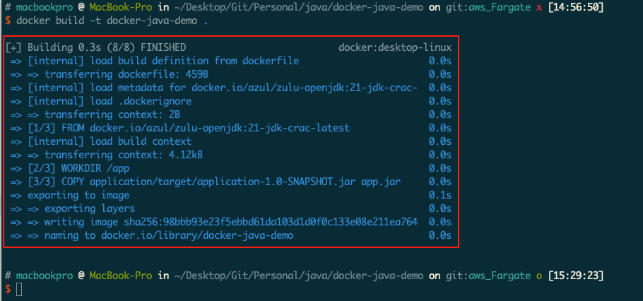
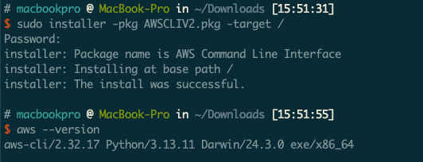
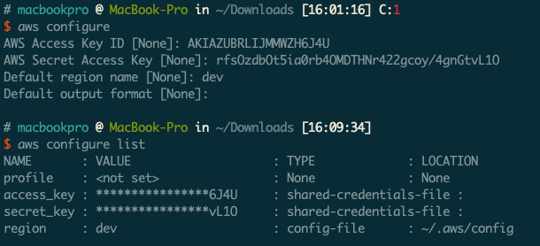
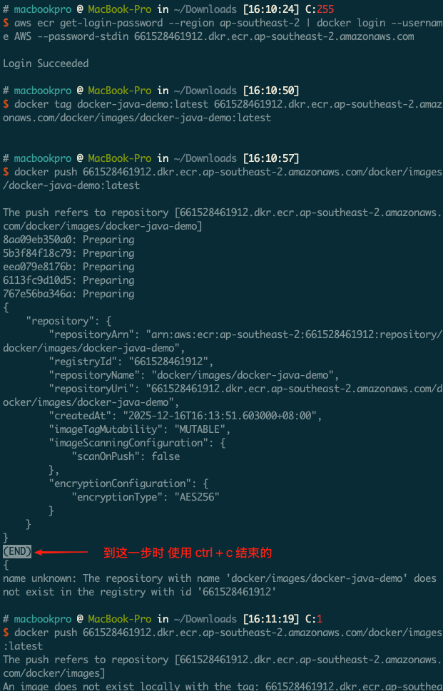
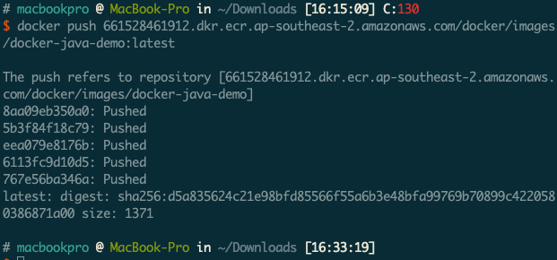
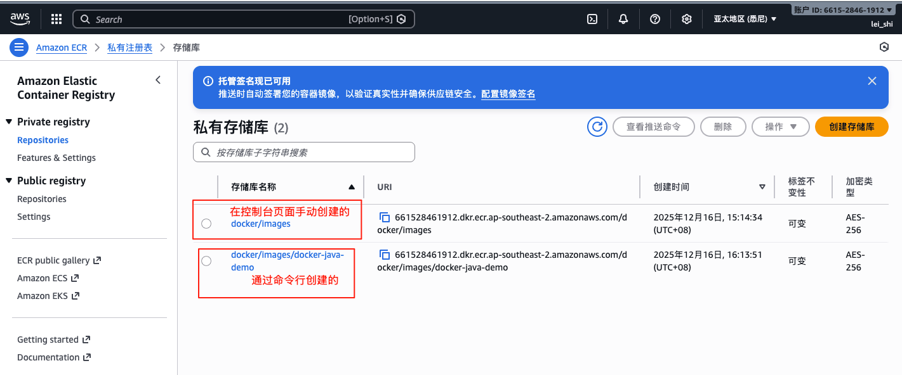
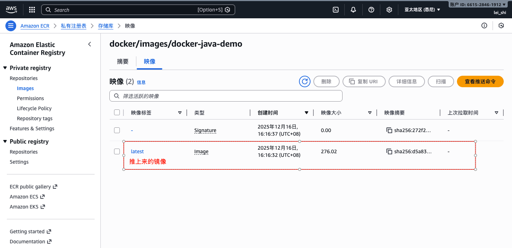
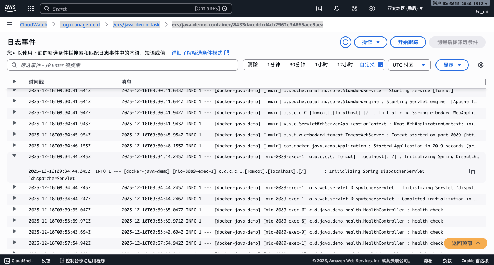
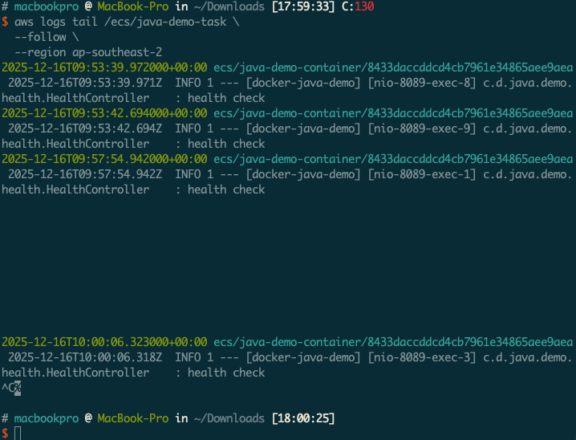

# docker-java-demo
## 项目介绍
docker-java-demo 是一个基于 Spring Boot 框架的 Java 项目，用于演示如何在 Docker 中部署 Java 应用程序。

## 健康检查
- http://localhost:8089/health - 健康检查接口，返回 `success` 表示应用程序正常运行。

## 使用 AWS Fargate 构建教程

### 1. 在当前项目根目录创建 dockerfile 文件

1. 创建 dockerfile 文件
2. 执行 mvn 命令构建项目
   ```
   mvn clean package
   ```

### 2. Dockerfile 构建 Docker 镜像
1. 构建 Docker 镜像
   ```
   docker build -t docker-java-demo .
   ```
   > 执行 docker 命令前需要将 docker 启动

   - docker 镜像构建成功
      

2. 查看镜像
   ```
   docker images
   ```
3. 运行容器
   ```
   docker run -d -p 8089:8089 --name java-demo docker-java-demo
   ```
4. 查看容器
   ```
   docker ps
   ```
5. 查看容器日志
   ```
   docker logs java-demo
   ```
6. 访问应用程序
   - 打开浏览器，访问 `http://localhost:8089/health`，如果返回 `success` 表示应用程序正常运行。
7. 停止容器
   ```
   docker stop java-demo
   ```
   
### 3. AWS CLI 安装并配置
#### 1. 先安装 AWS CLI
- 下载 AWS CLI V2 版本 AWSCLIV2： https://awscli.amazonaws.com/AWSCLIV2.pkg
- 安装 AWS CLI V2 版本，先 cd 到下载目录，然后执行下面命令
  ```
  sudo installer -pkg AWSCLIV2.pkg -target /
  ```
  

#### 2. 配置 AWS CLI
1. 首选需在 AWS 控制台获取 IAM 用户凭证

##### 步骤 1：登录 AWS 控制台

打开 AWS 官网：https://console.aws.amazon.com/，用 root 账号或有 IAM 权限的用户登录。

##### 步骤 2：进入 IAM 控制台

1. 在顶部搜索框输入「IAM」，点击「IAM Dashboard」进入 IAM 控制台；
2. 左侧导航栏点击「Users」（用户）→ 点击「Add users」（创建用户，若已有用户则直接选择该用户）。

##### 步骤 3：创建 IAM 用户（若未创建）

1. Step 1: Set user details：
    - 输入「User name」（如 `cli-user`），勾选「Provide user access to the AWS Management Console - optional」（可选，若仅 CLI 用则无需勾选）；
    - 点击「Next」。

2. Step 2: Set permissions：
    - 为用户分配权限（如 ECR 登录 / 推送需 `AmazonEC2ContainerRegistryFullAccess` 或自定义策略）；
    - 推荐方式：点击「Attach policies directly」→ 搜索并勾选 `AmazonEC2ContainerRegistryPowerUser`（最小权限，仅管理 ECR）；
    - 点击「Next」→「Create user」。

##### 步骤 4：创建访问凭证（Access Key + Secret Key）

1. 选中刚创建的用户（如 `cli-user`），进入用户详情页；
2. 切换到「Security credentials」（安全凭证）标签页；
3. 向下滚动到「Access keys」区域，点击「Create access key」；
4. 选择凭证用途：
    - 选择「Command Line Interface (CLI)」→ 勾选「I understand the above recommendation and want to proceed to create an access key」；
    - 点击「Next」→「Create access key」。

##### 步骤 5：保存凭证（关键！仅显示一次）

1. 页面会显示：
    - **Access key ID**：如 `AKIAXXXXXXXXXXXXXXX`；
    - **Secret access key**：如 `xxxxxxxxxxxxxxxxxxxxxxxxxxxxxxxxxxx`；
2. ✅ 必须点击「Download .csv file」保存到本地（或手动复制），**Secret Key 一旦关闭页面就无法再次查看**，丢失需重新创建。

##### 6. 配置 AWS CLI，执行下面命令
  ```
  aws configure
  ```
  

#### 4. 推送 Docker 镜像到 ECR
使用 AWS CLI 登录到 ECR 并推送镜像：

示例命令行：
```bash
# 登录到 ECR（替换 <your-region> 为您的 AWS 区域）
aws ecr get-login-password --region <your-region> | docker login --username AWS --password-stdin <your-account-id>.dkr.ecr.<your-region>.amazonaws.com

# 标记镜像（替换 <your-account-id> 和 <your-region>）
docker tag docker-java-demo:latest <your-account-id>.dkr.ecr.<your-region>.amazonaws.com/docker-java-demo:latest

# 推送镜像到 ECR
docker push <your-account-id>.dkr.ecr.<your-region>.amazonaws.com/docker-java-demo:latest
```

实际成功的命令行：
```bash
# 登录到 ECR（替换 <your-region> 为您的 AWS 区域）
aws ecr get-login-password --region ap-southeast-2 | docker login --username AWS --password-stdin 661528461912.dkr.ecr.ap-southeast-2.amazonaws.com

# 标记镜像（替换 <your-account-id> 和 <your-region>）
docker tag docker-java-demo:latest 661528461912.dkr.ecr.ap-southeast-2.amazonaws.com/docker/images/docker-java-demo:latest

# 推送镜像到 ECR
docker push 661528461912.dkr.ecr.ap-southeast-2.amazonaws.com/docker/images/docker-java-demo:latest
```

- 登录 aws cli 并标记成功
    

- 推送 docker 镜像成功
    

  - 在 AWS 控制台 -> 搜索 `Amazon ECR` -> `Amazon ECR` -> `Private registry` -> `Repositories`
    >   - [Repositories](https://ap-southeast-2.console.aws.amazon.com/ecr/private-registry/repositories?region=ap-southeast-2)
    
    - 镜像仓库页面：
        
    - 镜像页面：
      
    

### 5. 创建 AWS Fargate 任务定义

在 AWS 控制台中，导航到 Amazon ECS 服务：

- 点击 任务定义 > 创建新任务定义
- 选择 Fargate 启动类型
- 配置任务定义参数：
  - 任务定义名称：docker-java-demo-task
  - 任务内存：1 GB
  - 任务 CPU：0.5 vCPU
- 点击 添加容器，配置容器参数：
  - 容器名称：docker-java-demo
  - 镜像：<your-account-id>.dkr.ecr.<your-region>.amazonaws.com/docker-java-demo:latest
  - 端口映射：添加映射，主机端口 0，容器端口 8089
- 点击 添加，然后点击 创建

### 6. 创建 AWS Fargate 服务

- 在 ECS 服务中，选择或创建一个 Fargate 集群
- 点击 服务 > 创建
- 配置服务参数：
  - 启动类型：Fargate
  - 任务定义：选择您刚刚创建的 docker-java-demo-task
  - 服务名称：docker-java-demo-service
  - 所需任务数：1
- 点击 下一步，配置网络：
  - 选择一个 VPC 和至少两个子网
  - 安全组：允许 8089 端口的入站流量
- 点击 下一步，配置负载均衡器（可选）：
  - 如果需要，可以配置一个应用负载均衡器来访问您的应用程序
- 点击 下一步，然后点击 创建服务

### 7. 访问应用程序

- 服务创建完成后，您可以在服务详情页面查看任务的公共 IP 地址
- 使用该 IP 地址访问应用程序：`http://3.107.250.13:8089/health`
如果您配置了负载均衡器，可以通过负载均衡器的 DNS 名称访问应用程序：http://3.107.250.13:8089/health

### 8. 查看日志
- 方式一：[在控制台点击对应的日志流查看](https://ap-southeast-2.console.aws.amazon.com/cloudwatch/home?region=ap-southeast-2#logsV2:log-groups/log-group/$252Fecs$252Fjava-demo-task/log-events/ecs$252Fjava-demo-container$252F8433daccddcd4cb7961e34865aee9aea)
  `CloudWatch` --> `Log management` --> `/ecs/java-demo-task` --> `ecs/java-demo-container/8433daccddcd4cb7961e34865aee9aea`
  
- 方式二：在本机命令行查看实时日志
    ```bash
      # 实时跟踪日志（类似 tail -f）
      aws logs tail /ecs/java-demo-task \
        --follow \
        --region ap-southeast-2
    ```
    
    > 实时日志查看大概有 `1 ~ 2` 秒延迟

- ECS Exec 进入容器查看本地日志（应急排查）
  
    若需查看容器内未推送到 CloudWatch 的本地日志（如 JAR 包日志文件）：
    ``` bash
    # 1. 进入运行中的容器终端（替换 任务ID）
    aws ecs execute-command \
    --cluster java-demo-cluster \
    --task <任务ID> \
    --container java-demo-container \
    --interactive \
    --command "bash" \
    --region ap-southeast-2
    
    # 2. 在容器内查看日志（示例，根据你的日志路径调整）
    # 查看 Spring Boot 应用日志文件
    cat /app/app.log
    # 实时跟踪日志
    tail -f /app/app.log
    # 查看最近 100 行日志
    tail -n 100 /app/app.log
    ```

### 服务更新（镜像更新→重新部署）

程序更新核心流程：**本地构建新镜像 → 推送新镜像到 ECR → 更新 ECS 任务 / 服务 → 重启 Fargate 任务**，分「单任务」和「服务（多实例）」两种场景：
